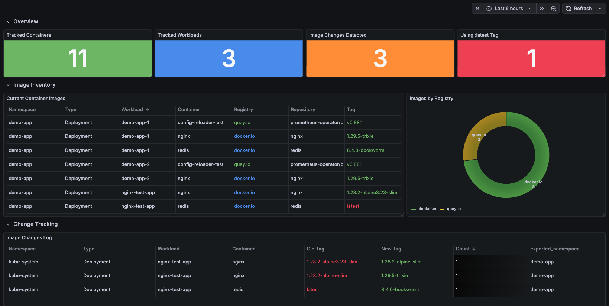

# Sentinel


----

**A Kubernetes controller that watches your cluster and exposes container image inventory as Prometheus metrics.**

Sentinel monitors Kubernetes workloads across labeled namespaces and tracks which container images are running in your cluster — exposed as Prometheus metrics with support for dynamic label enrichment from workload annotations and labels.

<br>

- [Sentinel](#sentinel)
  - [Why Sentinel?](#why-sentinel)
  - [Quick Start](#quick-start)
    - [Prerequisites](#prerequisites)
    - [Installation](#installation)
  - [Metrics Exposed](#metrics-exposed)
    - [`sentinel_container_image_info`](#sentinel_container_image_info)
    - [`sentinel_image_changes_total`](#sentinel_image_changes_total)
  - [Dynamic Label Enrichment](#dynamic-label-enrichment)
  - [⚙️ Configuration](#️-configuration)
    - [1. Config file (`/etc/sentinel/sentinel.yaml`)](#1-config-file-etcsentinelsentinelyaml)
    - [2. Environment variables](#2-environment-variables)
    - [3. CLI flags](#3-cli-flags)
    - [Configuration Reference](#configuration-reference)
  - [📊 Grafana Dashboard](#-grafana-dashboard)
  - [Local Development](#local-development)
    - [Build and Run Locally](#build-and-run-locally)
    - [Test with KIND](#test-with-kind)
  - [🌟 Project Status](#-project-status)

<br>

## Why Sentinel?

Gain real-time visibility into your cluster's container image landscape. Perfect for:

- **Image Inventory Tracking** – Know exactly what's running, where, and when
- **Security & Compliance** – Monitor image versions across namespaces
- **Version Drift Detection** – Spot outdated or unauthorized images quickly
- **Change Tracking** – Track image updates with old/new tag audit trail
- **Audit & Governance** – Enrich metrics with custom labels like `owner` or `environment`
  
<br>


## Quick Start

### Prerequisites

- Kubernetes cluster (>= v1.28)
- `kubectl` configured
- KIND or Minikube for local testing

### Installation

1. **Deploy Sentinel to your cluster:**

```bash
kubectl apply -f manifests/install/sentinel.yaml
```

2. **Label the namespaces you want Sentinel to watch:**

```bash
kubectl label namespace my-namespace sentinel.io/controlled=enabled
```

3. **Access metrics:**

Sentinel exposes metrics on port `9090` at `/metrics`:

```bash
kubectl port-forward -n kube-system svc/sentinel-metrics 9090:9090
curl localhost:9090/metrics
```
<br>
<br>

## Metrics Exposed

### `sentinel_container_image_info`

Info metric (Gauge, always `1`) providing a full inventory of container images running in your cluster.

**Labels:**

| Label | Description | Example |
|-------|-------------|---------|
| `workload_namespace` | Kubernetes namespace | `production` |
| `workload_type` | Kind of workload | `Deployment` |
| `workload_name` | Name of the workload | `api-server` |
| `container_name` | Container within the workload | `nginx` |
| `image` | Full image string | `ghcr.io/myorg/app:v1.2.3` |
| `image_registry` | Parsed registry | `ghcr.io` |
| `image_repository` | Parsed repository | `myorg/app` |
| `image_tag` | Parsed tag | `v1.2.3` |
| *dynamic labels* | From `extraLabels` config | `owner`, `env`, etc. |

**Example output:**

```prometheus
sentinel_container_image_info{
  workload_namespace="production",
  workload_type="Deployment",
  workload_name="api-server",
  container_name="nginx",
  image="nginx:1.28.2-alpine-slim",
  image_registry="docker.io",
  image_repository="nginx",
  image_tag="1.28.2-alpine-slim",
  owner="platform-team",
  env="production"
} 1
```
<br>

### `sentinel_image_changes_total`

Counter that increments every time a container's image tag changes, providing an audit trail of deployments.

**Labels:**

| Label | Description | Example |
|-------|-------------|---------|
| `workload_namespace` | Kubernetes namespace | `production` |
| `workload_type` | Kind of workload | `Deployment` |
| `workload_name` | Name of the workload | `api-server` |
| `container_name` | Container within the workload | `nginx` |
| `old_image_tag` | Previous image tag | `1.28.2-alpine-slim` |
| `new_image_tag` | New image tag | `1.29.0-alpine-slim` |

**Example output:**

```prometheus
sentinel_image_changes_total{
  workload_namespace="production",
  workload_type="Deployment",
  workload_name="api-server",
  container_name="nginx",
  old_image_tag="1.28.2-alpine-slim",
  new_image_tag="1.29.0-alpine-slim"
} 1
```

**Useful PromQL queries:**

```promql
# Count all image changes in the last 24 hours
sum(increase(sentinel_image_changes_total[24h]))

# Alert: too many image changes in production
sentinel_image_changes_total{workload_namespace="production"} > 5

# Find containers still using :latest
sentinel_container_image_info{image_tag="latest"}

# Count containers per registry
count by (image_registry) (sentinel_container_image_info)
```

<br>

## Dynamic Label Enrichment

Sentinel can extract annotations and labels from your workloads and expose them as Prometheus metric labels. This is configured via `extraLabels`:

```yaml
extraLabels:
  - type: "annotation"           # Where to look: "annotation" or "label"
    key: "sentinel.io/owner"     # The key to extract
    timeseriesLabelName: "owner" # The Prometheus label name
  - type: "label"
    key: "environment"
    timeseriesLabelName: "env"
```

If a workload doesn't have the specified annotation or label, the metric label will be set to an empty string `""`.

This allows each organization to enrich metrics with the labels that matter to them — team ownership, cost center, environment, or any other metadata.

<br>


## ⚙️ Configuration

Sentinel can be configured via:

### 1. Config file (`/etc/sentinel/sentinel.yaml`)

```yaml
namespaceSelector:
  "sentinel.io/controlled": "enabled"
metricsPort: "9090"
verbosity: 2

extraLabels:
  - type: "annotation"
    key: "sentinel.io/owner"
    timeseriesLabelName: "owner"
  - type: "label"
    key: "environment"
    timeseriesLabelName: "env"
```

### 2. Environment variables

```bash
# Note: Complex types (maps, arrays) should be configured via YAML file
# Only simple values can be overridden via environment variables
export METRICSPORT=9090
export VERBOSITY=2
```

### 3. CLI flags

```bash
sentinel start -v=2
```

### Configuration Reference

| Key | Type | Default | Description |
|-----|------|---------|-------------|
| `namespaceSelector` | `map[string]string` | `{"sentinel.io/controlled": "enabled"}` | Label selector for namespaces to watch |
| `metricsPort` | `string` | `"9090"` | Port for Prometheus metrics endpoint |
| `verbosity` | `int` | `0` | Log level: 0=Info, 1=Warn, 2=Debug |
| `extraLabels` | `[]ExtraLabel` | `[]` | Additional labels to extract from workloads |

<br>

## 📊 Grafana Dashboard

A pre-built Grafana dashboard is included in [`dashboard/grafana.json`](dashboard/grafana.json). Import it into your Grafana instance for:

- **Overview stats** – Tracked containers, workloads, image changes, and `:latest` tag usage
- **Image inventory table** – Current container images with color-coded tags (`:latest` in red)
- **Registry distribution** – Donut chart showing image count by registry
- **Change tracking log** – Table of all detected image changes with old → new tags



<br>

## Local Development

### Build and Run Locally

```bash
# Initialize Go module
go mod tidy

# Build the binary
go build -o sentinel
```

### Test with KIND

```bash
# Build Docker image
docker build -t sentinel:latest .

# Load into KIND cluster
kind load docker-image sentinel:latest --name <cluster-name>

# Deploy Sentinel
kubectl apply -f manifests/install/sentinel.yaml

# Deploy demo workloads
kubectl apply -f manifests/develop/demo-app-1.yaml
kubectl apply -f manifests/develop/demo-app-2.yaml

# Verify metrics
kubectl port-forward -n kube-system svc/sentinel-metrics 9090:9090
curl -s localhost:9090/metrics | grep sentinel_
```


## 🌟 Project Status

Sentinel is in **active development** as a learning project to master Go and Kubernetes controller patterns.

**Current capabilities:**
- ✅ Namespace watching with label selectors
- ✅ Deployment monitoring with real-time informers
- ✅ Container image parsing (registry, repository, tag)
- ✅ Prometheus metrics server
- ✅ Dynamic label enrichment from annotations/labels
- ✅ Image change tracking (old tag → new tag)
- ✅ Grafana dashboard
- 🚧 StatefulSet/DaemonSet/CronJob support (planned)
- 🚧 Init container support (planned)
- 🚧 Metric cleanup on workload deletion (planned)

---

**Built with ❤️ and Go** | [Report an Issue](https://github.com/MatteoMori/sentinel/issues)
